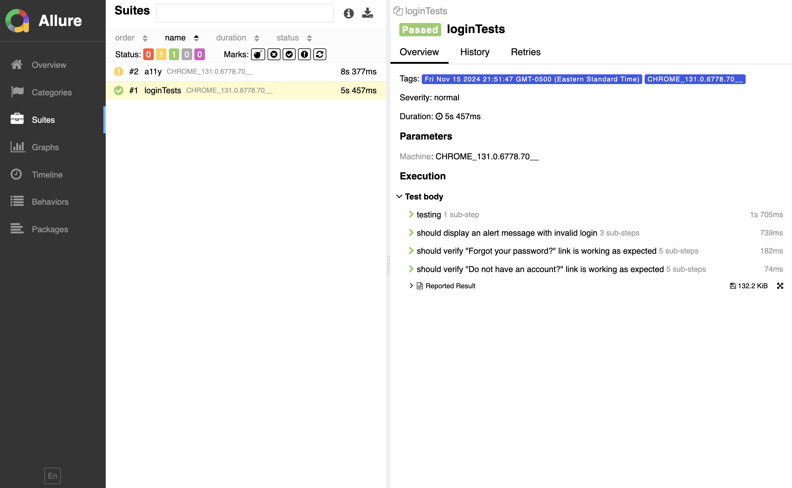
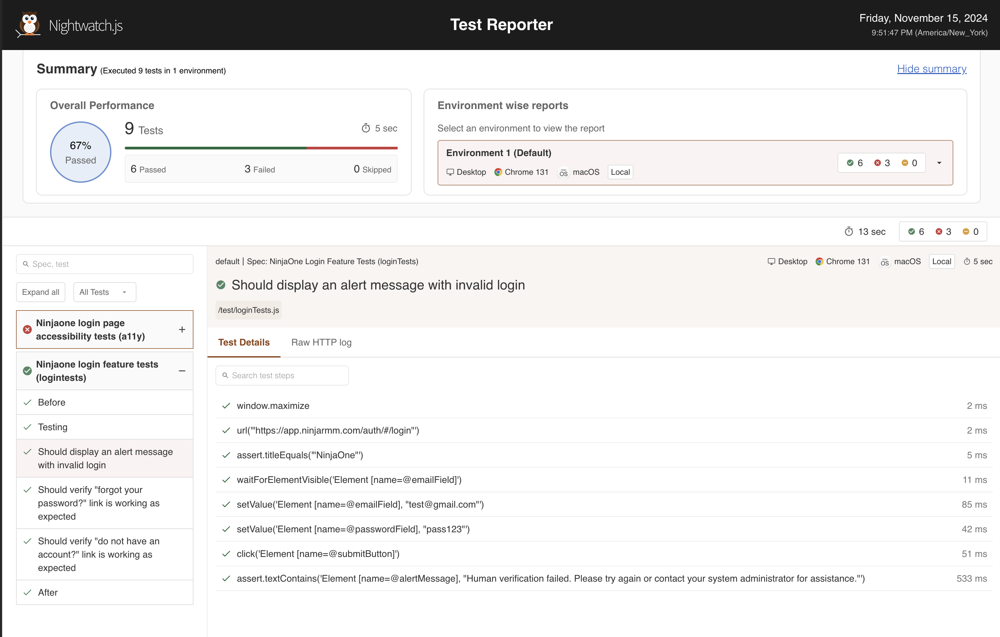

# NinjaOne App Automation Tests

This project contains automated tests for the NinjaOne application using Nightwatch.js. 

The primary focus is to demonstrate tests on the login page, including verifying login credentials, checking the "Forgot your password?" link, validating the "Do not have an account?" link, and performing accessibility tests.


## Prerequisites & Setup

1. Make sure [node.js](https://nodejs.org/en) is installed

2. Execute the following command in your terminal to install Nightwatch globally:

    ```sh
    npm install -g nightwatch@latest
    ```

3. Run `npm install` to install the project dependencies.

4. Make sure Allure Commandline is installed in your machine (for Allure report).
    ```sh
    npm install -g allure-commandline
    ````


## Running Test

Several scripts are available for test runs.

* For running all tests:

    ```sh
    npm run test
    ```
* For running tests with specific tag:

    ```sh
    npm run tag
    ```
* For running tests with **Allure report**, use the following command:

    ```sh
    npm run test:allure
    ```
* For running tests with **Nightwatch html report**, use the following command:

    ```sh
    npm run test:nightwatch
    ```


## Sample Test Reports

### Allure Report



### Nightwatch Report

